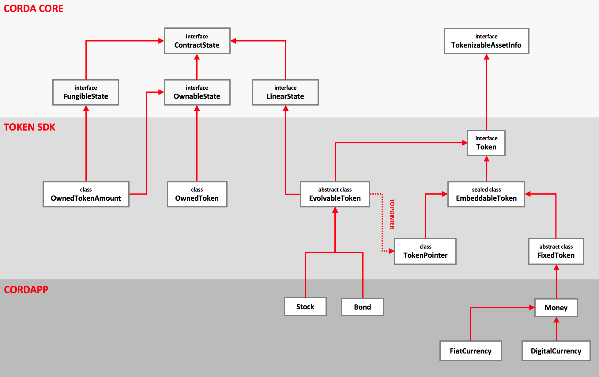

# Corda State Hierarchy Design

This paper describes a new approach to modelling financial things on Corda. There are two key intuitions behind the model:

1. The notion of "fungibility" can be an attribute of any state type, not just `OwnableState`s and "assets"
2. The lifecycle of a financial instrument should be orthogonal to the notion of ownership of the instrument

## Modelling financial instruments

**TL;DR Money and securities are agreements but we model them as `OwnableState`s for legacy reasons.**

All "legacy" financial instruments are agreements (or contracts, but here we won't use the term "contract" as it is too heavily overloaded in the DLT world); this includes all forms of fiat money and securities.

Indeed, if you "look" at a financial instrument, you'll most likely be looking at some form of legal document:

* A £10 note is a legal document *"I promise to pay the bearer on demand..."*
* A bond indenture is a large pile of legal documents prepared by a borrower for their investors
* A loan is a legal document prepared by a lender and probably never read in detail by the borrower
* A stock certificate or share agreement includes the name of the issuing company and the investor

The following diagram demonstrates fiat currency as agreements between the central bank, banks and individuals:


The diagram depicts two forms of fiat currency:

* *Central bank reserves* are a liability of central banks. In the past, central bank reserves were backed by physical assets and redeemable on demand but these days this usually not the case; the central bank will mostly hold government bonds, repos and other types of debt on their debt on the asset side of their balance sheet.
* A *commercial bank deposit*, or "cash" as it is known to most people, is a **liability of your bank to deliver a liability of the central bank**.

In summary: fiat currency, in whatever form, is just an accounting entry. This is despite the fact that cash "feels" like an "ownable" thing. Indeed, in Corda to date, cash is modelled as an ownable thing (`OwnableState` / `FungibleAsset`). However, really, it is an agreement between an obligor (the bank), and a beneficiary (the owner).

When sending a cash state to another party with Corda, the receiving party must traverse the chain of provenance to assure themselves that what they are receiving really is a valid claim on an issuer (obligor).

What's happening here is that the action of traversing the chain of provenance collapses down all the movements of the cash state into — what amounts to — an agreement between the issuer and the current owner.


The same principle applies for equity and debt, which are agreements between companies and investors.

### What is an agreement in Corda?

Any state object which contains two or more distinct `Party` (or `AbstractParty`) objects in the state definition. Examples:

* `issuer` and `owner` in the cash state
* two `participants` in a `LinearState` representing an interest rate swap

Although they usually are, the parties don't _have_ to be listed in the `participants` property, there just needs to be two or more parties specified in the state object. With Corda, the `participants` property is used to:

* help ascertain which parties could be required to sign a transaction involving this state
* determine which parties store this state in their vaults

In the case of cash, the only participant should generally be the owner as the expectation is that that cash states should move around without the issuer's knowledge.

### So what is not an agreement?

**TL;DR The only non-agreements on ledger are ledger native crypto tokens.**

Things which are "ownable" (not in the `OwnableState` sense) and have no counterparty are not agreements. These types of things typically *do not* have issuers but can do in some cases. Some examples include:

| Thing                 | Comments                                                     | Has Issuer                | Has owner |
| --------------------- | ------------------------------------------------------------ | ------------------------- | --------- |
| Physical commodities  | Commodities are dug out of the ground.                       | No                        | Yes       |
| Freehold real- estate | Freehold real-estate can be thought of as being owned out-right. Technically speaking, the Crown is the only absolute owner of land in England and Wales. When land/property is bought/sold, titles to the land change hands rather than the land, itself. This is why ownership is ultimately determined by the land registry and not based on a sales contract. | No                        | Yes       |
| Chattels              | Stuff in your house which is owned out-right. Also, antiques. | No                        | Yes       |
| Cryptocurrency        | Permissionless, pseudo-anonymous crypto-currencies like Bitcoin whivh have unidentifiable issuers. There is no-one to sue if you lose your coins! | Unidentifiable            | Yes       |
| Utility tokens        | Utility tokens which confer no rights to owners              | Yes but has no obligation | Yes       |

To complicate things more, it is worth noting that physical commodities, freehold real-estate and chattels, etc. **cannot exist on Corda in material form**, hence the need for "tokenization"— tokens are created by an issuer to represent claims on themselves to deliver a specific amount of the off-ledger "thing" in return for redemption of the token. In other words, the token is an agreement!

The nature of the issuer, whether they are a custodian or bank, for example, is out of scope for the purposes of this paper.

There are some forms of non-agreements which can exist on ledger: crypto-currencies and utility tokens which confer no rights. These are new-World digital assets and the Corda state model should be flexible enough to support them. In the proposed tokens model, these non-agreements would either be assigned an issuer which is a well known public key which represents a set of miners or a NULL public key.

Lastly, it goes without saying that any state object which contains only a single participant clearly cannot be an agreement. 

## Required additions to the core data model

The current versions of `ContractState` , `OwnableState` and `LinearState` in Corda Core are used as they exist today. As a refresher:

* `ContractState` is the base state definition in Corda. It requires implementations to define a `participants` list. This are the parties for which the state is relevant.
* `OwnableState` adds the cofncept of an owner to a state object
* `LinearState`s adds the concept of a `linearId` , this is useful for keeping track of states which represent a workflow, or non-fungible things.

### FungibleState

In addition to the above, a new `FungibleState` has been added for the following reasons:

* The old `FungibleAsset` state clearly assumes that the "thing" in question is a financial instrument but this is not always the case. Also, referring to states as "assets" is confusing, as one `Party`'s asset is another `Party`'s liability. Furthermore, fungible derivative contracts such as standardised exchange traded furtures contracts can flip from being a balance sheet asset or liability depending on the price of the underlying instrument. As such, the term "asset" and related nomenclature will be avoided. Instead, we will refer to tokens—which are agreements between issuers and owners.
* `FungibleAsset` implements `OwnableState` , as such there is an assumption that all fungible things are ownable. This is not always true as fungible derivative contracts exist, for example.

The new `FungibleState` is simply defined as:

```kotlin
interface FungibleState<T : Any> : ContractState {
    val amount: Amount<T>
}
```

Where `T` is some type of token or a reference to a type of token defined elsewhere. `T` deliberately has no upper-bound to maintain flexibility going forward. Note that `Issuer` is omitted and the interface implements `ContractState` as opposed to `OwnableState`, again, this is to provide flexibility.

**Note:** This has already been added to Corda core. See [here](https://github.com/corda/corda/blob/dd60ae27f2dadd12d121d3ecbb951bdaf2725272/core/src/main/kotlin/net/corda/core/contracts/FungibleState.kt).

### StatePointer

This paper proposes to add a new type called `StatePointer `. `StatePointer`s formalise a pattern whereby CorDapp developers refer to a state from inside another state. For example:

```kotlin
data class FooState(val ref: StateRef) : ContractState
```

`StatePointer`s come in two variants:

* `StaticPointer`s which refer to a specific `StateRef`, or; 
*  `LinearPointer`s which allow a `ContractState` to "point" to the most up-to-date version of a state. Instead of linking to a specific `StateRef`, using a `StaticPointer` a, `LinearPointer` contains the `linearId` of the lineage of `LinearState` to point to.

State pointing is a useful pattern when one state depends on the contained data within another state and there is an expectation that the state being depended upon will involve independently to the depending state.

```kotlin
class LinearPointer<T : LinearState>(
    override val pointer: UniqueIdentifier, 
    override val type: Class<T>
) : StatePointer<T>() {
    
    override fun resolve(services: ServiceHub): StateAndRef<T> {
		// Omitted code.
    }

    override fun resolve(ltx: LedgerTransaction): StateAndRef<T> {
        return ltx.referenceInputRefsOfType(type).single { 
            pointer == it.state.data.linearId 
        }
    }

    // Omitted code.
}
```

The `LinearPointer` contains the `linearId` of the `LinearState` being pointed to and two `resolve` methods. Resolving a `LinearPointer` returns a `StateAndRef` containing the latest version of the `LinearState` that the node calling `resolve` is aware of. There are two issues to note with `LinearPointer`s:

1. If the node calling `resolve` has not seen any transactions containing a `LinearState` with the specified `linearId` then `resolve` will return null .
2. Even if the node calling `resolve` has seen and stored transactions containing a `LinearState` with the specified `linearId` , there is no guarantee the `StateAndRef` returned is the most recent version of the LinearState .

Both of the above problems can be resolved by adding the pointed-to `LinearState` as a [reference state](https://github.com/corda/corda/blob/master/docs/source/design/reference-states/design.md) to the transaction containing the state with the `LinearPointer` . This way, the pointed-to state travels around with the pointer, such that the `LinearPointer` can always be resolved. Furthermore, the reference states feature will ensure that the pointed-to state remains current. It's worth noting that embedding the pointed-to state may not always be preferable, especially if it is quite large.

From Corda 4 onwards, the `TransactionBuilder` [automatically resolves](https://github.com/corda/corda/blob/master/core/src/main/kotlin/net/corda/core/transactions/TransactionBuilder.kt#L517) `StatePointer`s to `StateAndRef`s and includes those `StateAndRef`s as reference states in the transaction. 

For a more detailed design document on `StatePointer`s please see [here](https://github.com/corda/corda/blob/master/docs/source/design/linear-pointer/design.md). See the implementation [here](https://github.com/corda/corda/blob/master/core/src/main/kotlin/net/corda/core/contracts/StatePointer.kt).

## The foundational state types

With the key concepts defined above, here's a proposal for a series of types which should be able to fulfil all use-cases involving agreements, tokens, assets (liabilities), etc.




To aid understanding of the (rather complex looking) diagram, it can be split into three parts:
1. A *light grey* area which corresponds to types defined in corda-core
2. A *darker grey* area which corresponds to new types defined in the token SDK
3. A *even darker area* which contains types that will be defined by CorDapp developers in their own apps

### Token SDK types 

#### Token

A `Token` is an overarching interface for all things `Token` related. All tokens implement this interface. `Token` refers to a "type of thing" as opposed to the vehicle which is used to assign units of a token to a particular owner. For that we use the  `OwnedToken` state for assigning non-fungible tokens to an owner and the `OwnedTokenAmount` state for assigning amounts of some fungible token to an owner. The interface implements `TokenizableAssetInfo` because in almost all cases, the `Token` must define the nominal display unit of a single `Token`. 

```kotlin
interface Token : TokenizableAssetInfo
```

#### EmbeddableToken

`EmbeddableToken`s are `Token`s which can be composed into an [OwnedToken] or an [OwnedTokenAmount]. They are almost always wrapped with an [Issued] class.

```kotlin
@CordaSerializable
sealed class EmbeddableToken : Token
```

#### FixedToken

A [FixedToken] is where the definition of a token is inlined into the [OwnedToken] or [OwnedTokenAmount] class. This is for tokens which you don't expect to evolve. Note that [FixedToken]s are not states! They don't need to be because the definition of the token never changes or hardly ever changes. You are certainly likely to use this when testing or creating tokens for currencies. If you do need to make changes to a [FixedToken] then they need to be made through upgrading your CorDapp. Then by redeeming and re-issuing the [OwnedToken] or [OwnedTokenAmount] with the new token. However, if your token is likely to need updating often, then use the [EvolvableToken] type.

```kotlin
abstract class FixedToken : EmbeddableToken() {
    abstract val symbol: String
}
```

#### TokenPointer

To harness the power of [EvolvableToken]s, they cannot be directly embedded in [OwnedToken] or [OwnedTokenAmoun]s. Instead, a [TokenPointer] is embedded. The pointer can be resolved inside the verify function to obtain the data within the token definition. This way, the [Token] can evolve independently from who owns it, as the data is held in a separate state object.

```kotlin
data class TokenPointer<T : EvolvableToken>(
        val pointer: LinearPointer<T>,
        override val displayTokenSize: BigDecimal
) : EmbeddableToken() {
    override fun toString(): String = "Pointer(${pointer.pointer.id}, ${pointer.type.canonicalName})"
}
```


```kotlin
open class FungibleToken<T : TokenType>(
    override val amount: Amount<TokenType>,
	override val owner: AbstractParty
) : FungibleState<T>, OwnableState {
	override val participants: List<AbstractParty> get() = listOf(owner)
  	inline fun <reified T : LinearState,
                  		U : TokenType.Definition<T>>resolveTokenType() : StateAndRef<T> {
  		TODO("not implemented")
	}
	override fun withNewOwner(newOwner: AbstractParty): CommandAndState {
  		return CommandAndState(Commands.Move(), copy(owner = newOwner))
	}
}
```

`FungibleToken` is something that can be split and merged. It contains the following properties:

* An amount of a specified `TokenType` . The `TokenType` can be an actual definition or a pointer to a definition
* An owner property of type `AbstractParty` , so the owner can be pseudo-anonymous 
* All `ContractState`s contain a participants property

It is easy to see that the `FungibleToken` is only concerned with which party "owns" a specified amount of some `TokenType`, which is defined elsewhere. As such `FungibleToken`s support three simple behaviours: `issue` , `move` , `redeem` . The "token app" will contain flows to create `FungibleToken`s of some `TokenType` then issue, move and redeem those tokens.

The `FungibleToken` class is defined as open so developers can create their own sub-classes,
e.g. one which incorporates owner whitelists, for example.

`FungibleToken` coupled with `TokenType` is the Corda version of **ERC-20**. The other part of the standard which is out of scope of things document are the flows to issue, move and redeem tokens as well as the types used to define `TokenType`s.

This class can be used to represent any type of fungible financial instrument.

#### TokenType

`TokenType` is essentially a "union type". It contains the definition of a token or a pointer to a definition of a token. `TokenType` itself is just an interface. It is best explained by showing the code:

```kotlin
// Implements TokenizableAssetInfo so arthimetic operations can be performed.
interface TokenType : TokenizableAssetInfo {
    
    // A LinearState representing a TokenDefinition.
    data class Definition<T : TokenDescription>(
            val data: T,
            val creator: Party,
             override val linearId: UniqueIdentifier = UniqueIdentifier()
    ) : TokenType, LinearState {
        override val displayTokenSize: BigDecimal get() = data.displayTokenSize
        override val participants: List<AbstractParty> get() = listOf(creator)
        
        // Can be converted to a Pointer.
        fun toPointer() = Pointer(data.symbol, data.name, linearId, data.displayTokenSize)
        override fun toString() = data.symbol
    }
    
    // Pointer must contain _some_ minimal info about the token
    // definition, namely the minimum token size and a symbol.
    data class Pointer(
            val symbol: String,
            val name: String,
            override val pointer: UniqueIdentifier,
            override val displayTokenSize: BigDecimal
    ) : TokenType, LinearPointer() {
        override fun toString() = "$symbol (Pointer)"
    }
}
```

For `TokenType`s with immutable definitions such as Bitcoin or most commodities, a `TokenType.Definition` can be used directly inside a `FungibleToken`.

```kotlin
 // Definition of a Commodity Token.
class Commodity(
        override val symbol: String,
        override val name: String,
        override val displayTokenSize: BigDecimal,
        override val issuer: Party
) : FungibleTokenDescription, Issuable

// West Texas Intermediate crude oil issued by Alice.
val wti = Commodity(
    symbol = "WTI",
    name = "West Texas Intermediate",
    displayTokenSize = BigDecimal.ONE,
    issuer = ALICE
)

// The token definition is on-ledger as a state. It may or may not evolve over time.
// Alice created this definition as she is the issuer.
val tokenDefinition = TokenType.Definition(data = wti, creator = ALICE)

// Helpers.
fun barrels(amount: Long) = Amount(amount, tokenDefinition)
val Int.WTI: Amount<TokenType.Definition<Commodity>> get() = barrels(this.toLong())

// Create ten barrels of oil.
// This is an agreement between Bob and Alice; for Alice to deliver
// ten barrels of oil to Bob when Bob asks that the token be redeemed.
val tenBarrelsOfOilOwnedByBob = FungibleToken(10.WTI, BOB)
```

For those `TokenType`s that would expect to evolve, a pointer to the `TokenType.Definition` can be used instead, this is the `TokenType.Pointer` class. The intuition here is that the issuers of `FungibleState`s should manage the lifecycle of the `TokenType` independently to the process which manages ownership of the tokens. As such, you can see that `TokenType.Definition` is defined as a `LinearState`, so the definition can evolve.

**Example:** Take a stock issued by MEGA CORP. It can be initially issued by MEGA CORP, they may then announce a divided, pay a dividend, perform a share split, etc. This should all be managed inside the `TokenType.Definition` state. MEGA CORP is at liberty to define which ever properties and methods they deem necessary on the `TokenType.Definition`. Only MEGA CORP has the capability of updating the `TokenType.Definition`.

Other parties on the Corda Network that hold MEGA CORP stock, use the `TokenType.Definition` as reference data. It is likely that MEGA CORP would distribute the `TokenType.Definition` updates via data distribution groups. Holders of MEGA CORP stock would subscribe to updates to ensure they have the most up-to-date version of the `TokenType.Definition` which reflects all recent lifecycle events.

The MEGA CORP example in code would be as follows:

```kotlin
// Example stock token.
class Stock(
      override val symbol: String,
      override val name: String,
      override val displayTokenSize: BigDecimal,
      override val issuer: Party
) : FungibleTokenDefinition, IssuableToken {
  // Things one can do with stock.
  fun dividend(amount: TokenType): Stock
}

// MEGA CORP Stock definition.
val megaCorpStock = Stock(
  symbol = "MEGA",
  name = "MEGA CORP",
  displayTokenSize = BigDecimal.ONE,
  issuer = MEGA_CORP
)

// Create then commit the token type definition to ledger with a Corda transaction.
// Share it with the parties which need to see it.
val tokenTypeDefinition = TokenType.Definition(data = megaCorpStock, creator = MEGA_CORP)

// Get a pointer to the token type definition and embed it in a fungible token state.
val tokenPointer = tokenTypeDefinition.toPointer()
val tenShares = FungibleToken(Amount(10L, tokenPointer), BOB)

// MEGA CORP announces a dividend and commits the updated token type definition to ledger.
val afterAnnouncement = megaCorpStock.dividend(10.POUNDS)
val updatedTokenTypeDefinition = tokenTypeDefinition.copy(data = afterAnnouncement)

// MEGA CORP distributes the updated token type definition to those who require it.

// Resolving the pointer gives us the updated token type definition.
val resolved = tenShares.resolveTokenType<Stock>(services)
```

Here, the `TokenType.Definition` is linked to the `FungibleState` via the `TokenType.Pointer`. The pointer includes the `linearId` of the `TokenType.Definition` and implements a `resolve` method.

We cannot link the `TokenType.Definition` by `StateRef` as the `FungibleState` would require updating each time the `TokenType.Definition` is updated! `resolve` allows developers to resolve the `linearId` to the `TokenType.Definition` state inside a flow. Conceptually, this is similar to the process where a `StateRef` is resolved to a `StateAndRef`.


#### Representing non-fungible tokens

Although not covered in the state hierarchy diagram, a non-fungible token can be implemented by using a `FungibleToken` with only one of (the smallest unit of) the specified `TokenType` . Specifically, the way to do this would be to create a `TokenType.Definition` then issue a `FungibleToken` with amount set to the smallest unit of the desired `TokenType.Definition`. If further units are issued, then the assumption is that these units are all fungible, implying fractional ownership in a single entity.

This is the equivalent of **ERC-721**.

An alternative approach is to create your own non-fungible state implementing `TokenType.Definition` and `OwnableState` as follows:

```kotlin
interface MyNonFungibleThing : OwnableState, TokenType.Definition
```

Here, `MyNonFungibleThing` is really just a `TokenType.Definition` (see above). This is because there is no need for there to be an amount of it as only one exists. Only create your own non-fungible states if we know definitively there will only ever be one token representing this “thing”. It is worth nothing that it is possible only one physical “thing” exists but many tokens are issued in respect of it to represent fractional ownership.

#### Representing other types of agreements

Frequently, we need to model other types of agreements, which are not "ownable" in the Corda sense—it does not make sense to implement the `OwnableState` . This is the case for financial instruments such as obligations, OTC derivatives and invoices, for example. These types of interfaces can be implemented by using the `LinearState` interface and optionally implementing a `TokenType.Definition` interface of the developers choosing.

Although not included in the type hierarchy diagram above, it would be trivial to create a bunch of helper interfaces which implement `LinearState` for these types of financial instruments.

An example would be integrating the ISDA common domain model ("CDM") with this proposal. All the CDM types would be encapsulated within a `LinearState` .

## Acknowledgements

* Farzad Pezeshkpour for his detailed review of this proposal. See his review [here](https://gist.github.com/dazraf/87c56a6039391f0613066ee2d6fe6c0e). 
* Jose Col
* Matthew Nesbit
* Mike Hearn
* Richard Brown

## Appendix

### Financial instrument taxonomy

These tables explain how common financial instruments and things map to the state types defined above; `FungibleToken`, `NonFungibleToken` and `LinearState`.


### Example `TokenDescription` interfaces

Here's a list of some example `TokenDescription`s which can be embedded in `FungibleToken` or `FungibleAgreement` .

```kotlin
// Base definitions.
interface TokenDescription<T : Any> {
	val of: T
}

interface Issuable {
	val issuer: Party
}

interface FungibleTokenDescription<T : Any> : TokenDescription<T>, TokenizableAssetInfo  {
	val symbol: String
	val name: String
}

interface Redeemable {
	val exitKeys: Collection<PublicKey>
}

interface AssetBackedToken<T : Any> : Issuable, Redeemable, FungibleTokenDescription<T>
```

### Composing `TokenDescription`s

`TokenDescription`s can be composed within each other to model more complex relationships. For example, we can implement the central bank and commercial bank example which was given in the first section of this paper:

```kotlin
// See interface definitions in above code samples.
// Note: No issuer here! This is the base definition.
data class FiatCurrency(override val of: Currency) : FungibleTokenDescription<Currency> {
    override val symbol: String get() = of.symbol
    override val name: String get() = of.displayName
    override val displayTokenSize: BigDecimal get() = 
    	BigDecimal.ONE.scaleByPowerOfTen(-of.defaultFractionDigits)
}

// Omitted Fungible descriptors to save space.
data class CentralBankReserves(
        override val of: FiatCurrency,
        override val issuer: Party
) : TokenDescription<FiatCurrency>, Issuable

// Omitted Fungible descriptors to save space.
data class CommercialBankDeposit(
        override val of: CentralBankReserves,
        override val issuer: Party
) : TokenDescription<CentralBankReserves>, Issuable

// Omitted Fungible descriptors to save space.
data class ElectronicMoney(
    override val of: CommercialBankDeposit,
    override val issuer: Party
) : TokenDescription<Currency>, Issuable

val gbp = FiatCurrency(GBP)
val gbpReserves = CentralBankReserves(gbp, BANK_OF_ENGLAND)
val gbpBankDeposit = CommercialBankDeposit(gbpReserves, BARCLAYS)
val gbpElectronicMoney = ElectronicMoney(gbpBankDeposit, E_MONEY_ISSUER)
```

When used in `FungibleToken`s, `TokenDescription`s are composed into `TokenType.Definition`s.

**TODO:**

* Investigate how linar pointers affect coin seelction. Looks at denormalising data to reduce the time needed for selecting coins.
* Explain how other types of composition would work. For example, where a `TokenDescription` comprises multiple other `TokenDescription`s. For example: Mortgage securitisation.
* Introduce the concept of obligations and how it fits in with Token types. "An obligation to deliver 10 of X token type".
