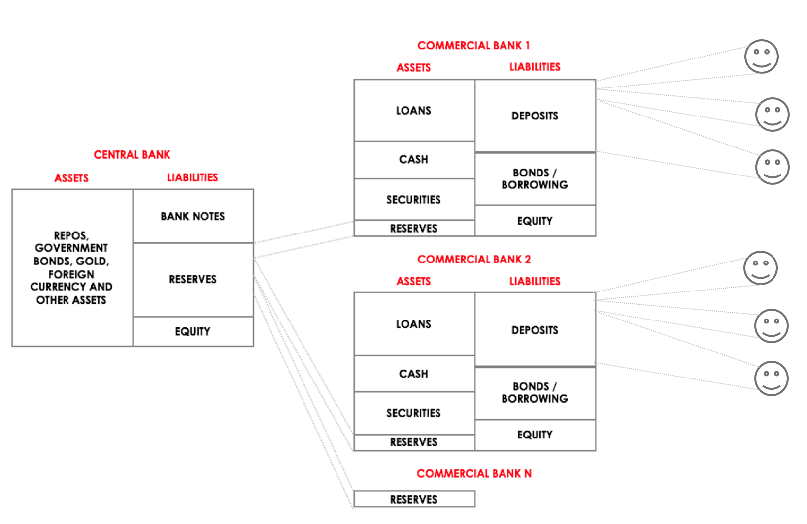
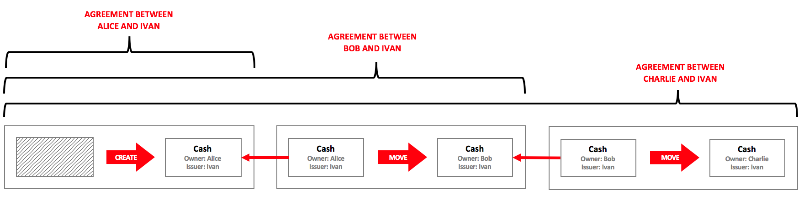
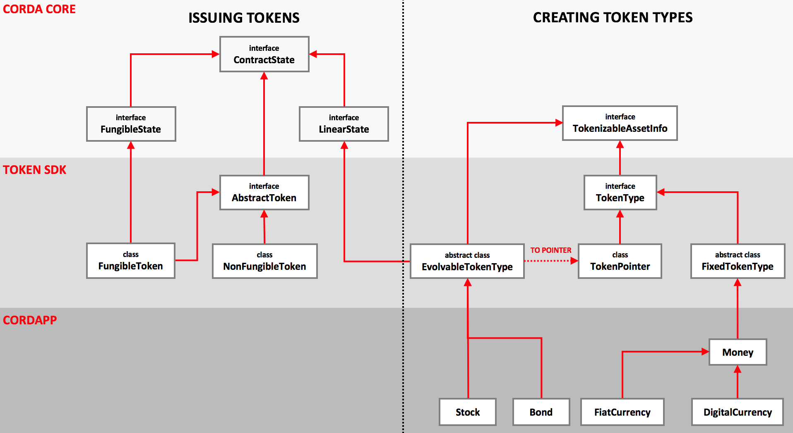
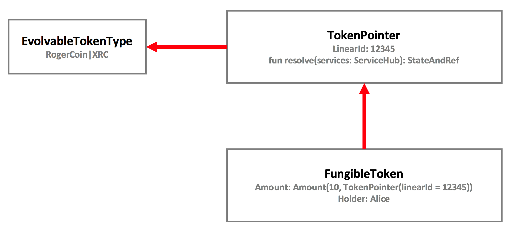
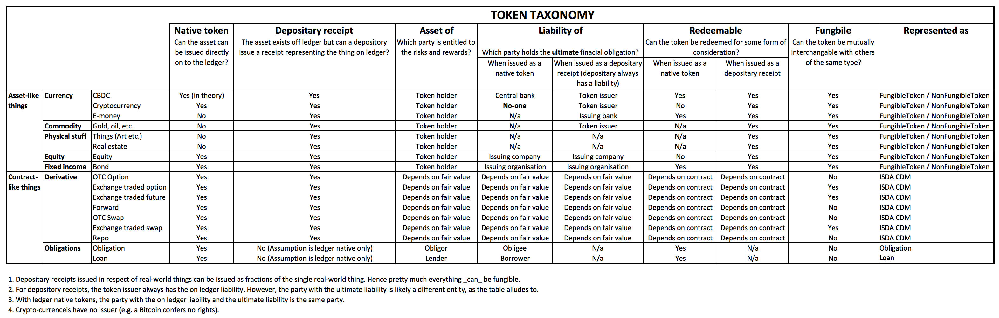

# Corda State Hierarchy Design

This paper describes a new approach to modelling financial things on Corda. There are two key intuitions behind the model:

1. The notion of "fungibility" can be an attribute of any state type, not just `OwnableState`s and "assets"
2. The lifecycle of a financial instrument should be orthogonal to the notion of participating in an agreement involving that instrument type

## Modelling financial instruments

**TL;DR Money and securities are agreements but we model them as `OwnableState`s for legacy reasons. The intuition here is that agreements are not ownable.**

All "legacy" financial instruments are agreements (or contracts, but here we won't use the term "contract" as it is too heavily overloaded in the DLT world); this includes all forms of fiat money and securities.

Indeed, if you "look" at a financial instrument, you'll most likely be looking at some form of legal document:

* A £10 note is a legal document *"I promise to pay the bearer on demand..."*
* A bond indenture is a large pile of legal documents prepared by a borrower for their investors
* A loan is a legal document prepared by a lender and probably never read in detail by the borrower
* A stock certificate or share agreement includes the name of the issuing company and the investor

The following diagram demonstrates fiat currency as agreements between the central bank, banks and individuals:



The diagram depicts two forms of fiat currency:

* *Central bank reserves* are a liability of central banks. In the past, central bank reserves were backed by physical assets and redeemable on demand but these days this usually not the case; the central bank will mostly hold government bonds, repos and other types of debt on their debt on the asset side of their balance sheet.
* A *commercial bank deposit*, or "cash" as it is known to most people, is a **liability of your bank to deliver a liability of the central bank**.

In summary: fiat currency, in whatever form, is just an accounting entry. This is despite the fact that cash *feels* like an "ownable" thing. Indeed, in Corda to date, cash is modelled as an ownable thing (`OwnableState` / `FungibleAsset`). However, really, it is an agreement between an obligor (the bank), and a beneficiary (the holder of the cash).

When sending a cash state to another party with Corda, the receiving party must traverse the chain of provenance to assure themselves that what they are receiving really is a valid claim on an issuer (obligor).

What's happening here is that the action of traversing the chain of provenance collapses down all the movements of the cash state into — what amounts to — an agreement between the issuer and the current holder.



The same principle applies for equity and debt, which are agreements between companies and investors.

### What is an agreement in Corda?

Any state object which contains two or more distinct `Party` (or `AbstractParty`) objects in the state definition. Examples:

* `issuer` and `owner` in the cash state
* two `participants` in a `LinearState` representing an interest rate swap
* `issuer` and `holder` in the `FungibleToken`

Although they usually are, the parties don't _have_ to be listed in the `participants` property, there just needs to be two or more parties specified in the state object. With Corda, the `participants` property is used to:

* help ascertain whether the signing parties for a transaction are authorised to sign, as ususally the signing parties _should_ be participants
* determine which parties store this state in their vaults—this is the notion of `Relevancy` in Corda

In the case of `Cash`, the only participant should typically be the current `owner` as the expectation is that that cash states should move around without the issuer's knowledge.

### So what is not an agreement?

**TL;DR The only non-agreements on ledger are ledger native crypto tokens.**

Things in the physical World which are "ownable" (not in the `OwnableState` sense) and have no counter-party are not agreements. These types of things *do not* have issuers. In the digital World, there can exist thinsg which _have_ issuers but are _not_ agreements. Some examples include:

| Thing                 | Comments                                                     | Has Issuer                | Has owner |
| --------------------- | ------------------------------------------------------------ | ------------------------- | --------- |
| Physical commodities  | Commodities are dug out of the ground.                       | No                        | Yes       |
| Freehold real- estate | Freehold real-estate can be thought of as being owned out-right. Technically speaking, the Crown is the only absolute owner of land in England and Wales. When land/property is bought/sold, titles to the land change hands rather than the land, itself. This is why ownership is ultimately determined by the land registry and not based on a sales contract. | No                        | Yes       |
| Chattels              | Stuff in your house which is owned out-right. Also, antiques. | No                        | Yes       |
| Cryptocurrency        | Permissionless, pseudo-anonymous crypto-currencies like Bitcoin whivh have unidentifiable issuers. There is no-one to sue if you lose your coins! | Unidentifiable            | Yes       |
| Utility tokens        | Utility tokens which confer no rights to owners              | Yes but has no obligation | Yes       |

To complicate things more, it is worth noting that physical commodities, freehold real-estate and chattels, etc. **cannot exist on Corda in material form**, hence the need for "tokenization"— tokens are created by an issuer to represent claims on themselves to deliver a specific amount of the off-ledger "thing" in return for redemption of the token. In other words, the token is an agreement!

The nature of the issuer, whether they are a custodian or bank, for example, is out of scope for the purposes of this paper.

There are some forms of non-agreements which can exist on ledger: crypto-currencies and utility tokens which confer no rights. These are new-World digital assets and the Corda state model should be flexible enough to support them. In the proposed tokens model, these non-agreements would either be assigned an issuer which is a well known public key which represents a set of miners or a NULL public key.

Lastly, it goes without saying that any state object which contains only a single participant clearly cannot be an agreement.

## Required additions to the core data model

The current versions of `ContractState` , `OwnableState` and `LinearState` in Corda Core are used as they exist today. As a refresher:

* `ContractState` is the base state definition in Corda. It requires implementations to define a `participants` list, which is a list of parties for which the state is relevant. I.e. only these parties will store this version of the state in their vault unless `StatesToRecord.ALL_VISIBLE` is used.
* `OwnableState` adds the concept of an owner to a state object. the `owner` is typically the only participant in an `OwnableState`. The token SDK doesn't use `OwnableState`.
* `LinearState`s add the concept of a `linearId` , this is useful for keeping track of states which represent a workflow, or non-fungible things. The `linearId` represents a particular lineage of `LinearState`s.

### FungibleState

In addition to the above, a new `FungibleState` has been added for the following reasons:

* The old `FungibleAsset` state clearly assumes that the "thing" in question is a financial instrument but this is not always the case. Also, referring to states as "assets" is confusing, as one `Party`'s asset is another `Party`'s liability. Furthermore, fungible derivative contracts such as standardised exchange traded furtures contracts can flip from being a balance sheet asset or liability depending on the price of the underlying instrument. As such, the term "asset" and related nomenclature will be avoided. Instead, we will refer to tokens—which are agreements between issuers and owners.
* `FungibleAsset` implements `OwnableState` , as such there is an assumption that all fungible things are ownable. This is not always true, as fungible derivative contracts exist, for example.

The new `FungibleState` is simply defined as:

```kotlin
interface FungibleState<T : Any> : ContractState {
    val amount: Amount<T>
}
```

Where `T` is some type of token or a reference to a type of token defined elsewhere. `T` deliberately has no upper-bound to maintain flexibility going forward. Note that `Issuer` is omitted and the interface implements `ContractState` as opposed to `OwnableState`, again, this is to provide flexibility.

**Note:** This has already been added to Corda core. See [here](https://github.com/corda/corda/blob/dd60ae27f2dadd12d121d3ecbb951bdaf2725272/core/src/main/kotlin/net/corda/core/contracts/FungibleState.kt).

### StatePointer

This paper proposes to add a new type called `StatePointer `. `StatePointer`s formalise a pattern whereby CorDapp developers refer to a state from inside another state. For example:

```kotlin
data class FooState(val ref: StateRef) : ContractState
```

`StatePointer`s come in two variants:

* `StaticPointer`s which refer to a specific `StateRef`, or; 
*  `LinearPointer`s which allow a `ContractState` to "point" to the most up-to-date version of a `LinearState`. Instead of linking to a specific `StateRef`, using a `StaticPointer` a, `LinearPointer` contains the `linearId` of the lineage of `LinearState` to point to. It goes without saying that `LinearPointer`s can only be used with `LinearState`s

State pointing is a useful pattern when one state depends on the contained data within another state and there is an expectation that the state being depended upon will involve independently to the depending state. This might be to divide responsibility for updates or to compartmentalise data for privacy reasons.

```kotlin
class LinearPointer<T : LinearState>(
    override val pointer: UniqueIdentifier, 
    override val type: Class<T>
) : StatePointer<T>() {
    
    override fun resolve(services: ServiceHub): StateAndRef<T> {
		// Omitted code.
    }

    override fun resolve(ltx: LedgerTransaction): StateAndRef<T> {
        return ltx.referenceInputRefsOfType(type).single { 
            pointer == it.state.data.linearId 
        }
    }

    // Omitted code.
}
```

The `LinearPointer` contains the `linearId` of the `LinearState` being pointed to and two `resolve` methods. Resolving a `LinearPointer` returns a `StateAndRef` containing the latest version of the `LinearState` that the node calling `resolve` is aware of. There are two issues to note with `LinearPointer`s:

1. If the node calling `resolve` has not seen any transactions containing a `LinearState` with the specified `linearId` then `resolve` will return null .
2. Even if the node calling `resolve` has seen and stored transactions containing a `LinearState` with the specified `linearId` , there is no guarantee the `StateAndRef` returned is the most recent version of the `LinearState`. This might be because the node in question doesn't have the most up-to-date transaction, and/or does have the most up-to-date transaction but the `LinearState` with the specified `linearId` was not stored in the vault.

Both of the above problems can be resolved by adding the pointed-to `LinearState` as a [reference state](https://github.com/corda/corda/blob/master/docs/source/design/reference-states/design.md) to the transaction containing the state with the `LinearPointer` . This way, the pointed-to state travels around with the pointer, such that the `LinearPointer` can always be resolved. Furthermore, the reference states feature will ensure that the pointed-to state remains current. It's worth noting that embedding the pointed-to state may not always be preferable, especially if it is quite large but in the majority of cases, this won't be a problem.

From Corda 4 onwards, the `TransactionBuilder` [automatically resolves](https://github.com/corda/corda/blob/master/core/src/main/kotlin/net/corda/core/transactions/TransactionBuilder.kt#L517) `StatePointer`s to `StateAndRef`s and includes those `StateAndRef`s as reference states in the transaction. 

For a more detailed design document on `StatePointer`s please see [here](https://github.com/corda/corda/blob/master/docs/source/design/linear-pointer/design.md). See the implementation [here](https://github.com/corda/corda/blob/master/core/src/main/kotlin/net/corda/core/contracts/StatePointer.kt).

## The foundational state types

With the key concepts defined above, here's a proposal for a series of types which should be able to fulfil all use-cases involving agreements, tokens, assets (liabilities), etc.




To aid understanding of the (rather complex looking) diagram, it can be split into three parts:
1. A *light grey* area which corresponds to types defined in corda-core
2. A *darker grey* area which corresponds to new types defined in the token SDK
3. A *even darker area* which contains types that will be defined by CorDapp developers in their own apps

### Token SDK types 

#### TokenType

A `TokenType` is an overarching interface for all things related to types fo tokens. 

As it suggests, `TokenType` refers to a "type of thing" as opposed to the vehicle which is used to assign units of a token to a particular owner. For that we use the  `NonFungibleToken` state for assigning non-fungible tokens to a holder and the `FungibleToken` state for assigning amounts of some fungible token to an holder. 

The interface implements `TokenizableAssetInfo` because in almost all cases, the `TokenType` must define the nominal display unit of a single `TokenType`. For example, JYP has zero fraction digits, whereas most currencies have two fraction digits. Therefore, to be able to reason about amounts of tokens arithmetically, we must define the fraction digits.

`TokenType` also defines a class and identifier which are used for serialisation.

```kotlin
@CordaSerializable
interface TokenType : TokenizableAssetInfo {
    val tokenIdentifier: String
    val tokenClass: String
}
```

`TokenType`s can be composed into a `NonFungibleToken` or a `FungibleToken` and they are almost always wrapped with an `IssuedTokenType` class.

#### IssuedTokenType

A type to wrap a `TokenType` with an issuing `Party`. The `TokenType` might be a ledger native asset such as an equity which is issued directly on to the ledger, in which case the issuing `Party` IS the securities issuer. In other cases, the `TokenType` would represent a depository receipt. In this case the issuing `Party` would be the custodian or securities firm which has issued the `TokenType` on the ledger and holds the underlying security as an asset on their balance sheet. The `Amount` of a `IssuedTokenType` they had issued would be the corresponding liability. The issuer of the underlying security held in custody would be implied via some of information contained within the token type state. E.g. a stock symbol or ISIN.

```kotlin
@CordaSerializable
data class IssuedTokenType<out T : TokenType>(
    val issuer: Party, 
    val tokenType: T
) : TokenType by tokenType {
	// Omitted code.
}
```

#### FixedTokenType

A `FixedTokenType` is where the definition of a token is inlined into the `NonFungibleToken` or `FungibleToken` class. This is for tokens which you don't expect to evolve over time. Note that `FixedTokenType`s are **not** states! They don't need to be because the definition of the token never changes or hardly ever changes. You are certainly likely to use this when testing or creating tokens for currencies (which don't typically evolve). If you do need to make changes to a `FixedTokenType` then they need to be made by either:

1. Upgrading your state and contract (see implicit and explicit upgrades in the Corda docs), or;
2. By specifying a new version of the token and then redeeming and re-issuing the `NonFungibleToken` or `FungibleToken` with the new token. 

However, if your `TokenType` is likely to need updating often, then use the `EvolvableTokenType` type.

```kotlin
abstract class FixedTokenType : TokenType {
    override fun toString(): String = "$tokenClass($tokenIdentifier)"
}
```

#### EvolvableTokenType

`EvolvableToken`s _are_ state objects because the expectation is that they will evolve over time. Of course in-lining a `LinearState` directly into the `NonFungibleToken` or `FungibleToken` state doesn't make much sense, as you would have to perform a state update to change the token type. Instead, it makes more sense to include a pointer to the token type. That's what `TokenPointer` is for (see below). This way, the token can evolve independently to which party currently holds (some amount of) the token type.

```kotlin
abstract class EvolvableToken : LinearState, TokenizableAssetInfo {
    abstract val maintainers: List<Party>

    /** Defaults to the maintainer but can be overridden if necessary. */
    override val participants: List<AbstractParty> get() = maintainers

    /** For obtaining a pointer to this [EvolveableToken]. */
    inline fun <reified T : EvolvableToken> toPointer(): TokenPointer<T> {
        val linearPointer = LinearPointer(linearId, T::class.java)
        return TokenPointer(linearPointer, displayTokenSize)
    }
}
```

It is expected that a specific set of `Party`s create and maintain `EvolvableTokenType`s. Note, that these `Party`s don't necessarily _have_ to be the issuer of the `EvolvableTokenType`. One of them probably _is_ the issuer of the token but may not necessarily be. For example, a reference data maintainer may create an `EvolvableTokenType` for some stock, keep all the details up-to-date, and distribute the updates. This `EvolvableTokenType`, can then be used by many issuers to create `FungibleToken`s (depository receipts) for the stock in question. Also the actual stock issuer (if they had a Corda node on the network) could use the same stock token to issue ledger native stock.



#### TokenPointer

To harness the power of `EvolvableTokenType`s, they cannot be directly embedded in `NonFungibleToken` or `FungibleToken`s. Instead, a `TokenPointer` is embedded. The pointer can be resolved inside the verify function and inside flows, to obtain the data within the `EvolvableTokenType`. This way, the `TokenType` can evolve independently from which party holds (some amount of) it, as the data is held in a separate state object.

```kotlin
data class TokenPointer<T : EvolvableToken>(
        val pointer: LinearPointer<T>,
        override val displayTokenSize: BigDecimal
) : EmbeddableToken() {
    override fun toString(): String = "Pointer(${pointer.pointer.id}, ${pointer.type.canonicalName})"
}
```

#### FungibleToken

The `FungibleToken` class is for handling the issuer and holder relationship for fungible token types. This state object implements `FungibleState` as the expectation is that it contains `Amount`s of an `IssuedTokenType` which can be split and merged. All `TokenType`s are wrapped with an `IssuedTokenType` class to add the issuer party, this is necessary so that the `FungibleToken` represents an agreement between an issuer of the `IssuedTokenType` and a holder of the `IssuedTokenType`. In effect, the `FungibleToken` conveys a right for the holder to make a claim on the issuer for whatever the `TokenType` represents.
```kotlin
open class FungibleToken<T : TokenType>(
        override val amount: Amount<IssuedTokenType<T>>,
        override val holder: AbstractParty
) : FungibleState<IssuedTokenType<T>>, AbstractToken(), QueryableState {
	// Methods omitted.
}
```

`FungibleToken` is something that can be split and merged. It contains the following properties:

* An amount of a specified `IssuedTokenType` . The `TokenType` can be an in-lined `TokenType` or a pointer to an `EvolvableTokenType`
* An owner property of type `AbstractParty` , so the holder can be anonymous 
* All `ContractState`s contain a `participants` property

It is easy to see that the `FungibleToken` is only concerned with which party holds a specified amount of some `TokenType`, which is defined elsewhere. As such `FungibleToken`s support three simple behaviours: `issue` , `move` , `redeem` . The tokens SDK will contain flows to create `FungibleToken`s of some `TokenType` then issue, move and redeem those tokens.

The `FungibleToken` class is defined as open so developers can create their own sub-classes,
e.g. one which incorporates owner whitelists, for example.

`FungibleToken` coupled with `TokenType` is the Corda version of **ERC-20**. The other part of the standard which is out of scope for this document are the flows to issue, move and redeem tokens.

#### NonFungibleToken

This class is for handling the issuer and holder relationship for non-fungible token types. Non-fungible tokens cannot be split and merged, as they are considered unique at the ledger level. If the `TokenType` is a
`TokenPointer`, then the token can evolve independently of who holds it. Otherwise, if a `FixedTokenType` is used then the `TokenType` is in-lined into the `NonFungibleToken` and it cannot change. There is no `Amount` property in this class, as the assumption is there is only ever ONE of the `IssuedTokenType` provided. It is up to issuers to ensure that only ONE of a non-fungible token ever issued. All `TokenType`s are wrapped with an `IssuedTokenType` class to add the issuer `Party`. This is necessary so that the `NonFungibleToken` represents an agreement between the issuer and holder. In effect, the `NonFungibleToken` conveys a right for the holder to make a claim on the issuer for whatever the `TokenType` represents. This is the equivalent of **ERC-721**.

```kotlin
open class NonFungibleToken<T : TokenType>(
        val token: IssuedTokenType<T>,
        override val holder: AbstractParty
) : AbstractToken(), QueryableState {
	// Methods omitted.
}
```

#### Representing other types of agreements

Frequently, we need to model other types of agreements, which are not "ownable" or "holdable" in the Corda sense—it does not make sense to implement the `OwnableState` . This is the case for financial instruments such as obligations, OTC derivatives and invoices, for example. These types of interfaces can be implemented by using the `LinearState` interface.

Although not included in the type hierarchy diagram above, it would be trivial to create a bunch of helper interfaces which implement `LinearState` for these types of financial instruments.

An example would be integrating the ISDA common domain model ("CDM") with this proposal. All the CDM types would be encapsulated within a `LinearState` which manages the workflow of the derivative contract.

### Examples

#### Money

We can define an example of a `FixedtokenType`, in this case `FiatCurrency`—which is already included in the `money` module of the token SDK.

```kotlin
// Abstract type for Money-like things.
abstract class Money : FixedTokenType() {
    abstract val description: String
}

// A simple definition of FiatCurrency using java.util.Currency.
class FiatCurrency(private val currency: Currency) : Money() {
    override val tokenIdentifier: String get() = currency.currencyCode
    override val tokenClass: String get() = javaClass.canonicalName
    override val description: String get() = currency.displayName
    override fun toString(): String = tokenIdentifier
    override val displayTokenSize: BigDecimal get() {
        return BigDecimal.ONE.scaleByPowerOfTen(-currency.defaultFractionDigits)
    }

    companion object {
        fun getInstance(currencyCode: String) { 
            return FiatCurrency(Currency.getInstance(currencyCode))
        }
    }
	// Other methods omitted.
}
```

We can now use the above definition to create some `FungibleToken`s:

```kotlin
// TokenType for GBP.
val gbp: FiatCurrency = GBP
// £10.
val tenPounds: Amount<FiatCurrency> = 10.GBP
// £10 issued by Alice, where ALICE is a Party object.
val issuedTenPounds = Amount<IssuedTokenType<FiatCurrency>> = tenPounds issuedBy ALICE
// £10 issued by Alice and owned by Bob.
val ownedTenPounds: FungibleToken<FiatCurrency> = issuedTenPounds ownedBy BOB
// Or all together with type inference.
val tenQuid = 10.GBP issuedBy ALICE ownedBy BOB
val oneMillionDollars = 1_000_000.USD issuedBy ZOE ownedBy RICH
```

The fungible tokens can used to create transactions:

```kotlin
// Couple the dollars with an issuer, in this case ZOE.
val zoeDollar: IssuedTokenType<FiatCurrency> = USD issuedBy ZOE
// Use "X of Y" syntax to create amounts of some IssuedTokenType.
val millionDollars = 1_000_000 of zoeDollar ownedBy BOB
// A transaction to issue a million Zoe Dollars.
val builder = TransactionBuilder(honestNotary).apply {
    // New output of a million dollars issued by JPM and owned by Bob.
    addOutputState(millionDollars)
    // Link the command to the token type.
    val zoeKey: PublicKey = zoeDollar.issuer.owningKey
    // Zoe is the signer to issue Zoe Dollars.
    addCommand(IssueTokenCommand(zoeDollar), listOf(zoeKey))
}
```

#### Stock

Take a stock issued by MEGA CORP. It can be initially issued by MEGA CORP, they may then announce a divided, pay a dividend, perform a share split, etc. This should all be managed inside an `EvolvableTokenType` state. MEGA CORP is at liberty to define which ever properties and methods they deem necessary on the `EvolvableTokenType`. Only MEGA CORP has the capability of updating the `EvolvableTokenType`.

Other parties on the Corda Network that hold MEGA CORP stock, use the `EvolvableTokenType` as reference data. It is likely that MEGA CORP would distribute the `EvolvableTokenType` updates via data distribution groups. Holders of MEGA CORP stock would subscribe to updates to ensure they have the most up-to-date version of the `EvolvableTokenType` which reflects all recent lifecycle events.

The MEGA CORP example in code would be as follows:

```kotlin
// Example stock token. This could be used for any stock type.
@BelongsToContract(StockContract::class)
data class Stock(
      override val symbol: String,
      override val name: String,
      override val displayTokenSize: BigDecimal,
      override val maintainers: List<Party>,
      override val linearId: UniqueIdentifier = UniqueIdentifier()
) : EvolvableTokenType() {
  // Things one can do with stock.
  fun dividend(amount: TokenType): Stock
}

// Define MEGA CORP Stock reference data then issue it on the ledger (not shown).
val megaCorpStock = Stock(
    symbol = "MEGA",
    name = "MEGA CORP",
    displayTokenSize = BigDecimal.ONE,
    maintainers = listOf(REF_DATA_MAINTAINER)
)

// Create a pointer to the MEGA CORP stock.
val stockPointer: TokenPointer<Stock> = megaCorpStock.toPointer()
// Create an issued token type for the MEGA CORP stock.
val issuedMegaCorpStock = stockPointer issuedBy CUSTODIAN
// Create a FungibleToken for some amount of MEGA CORP stock.
val stockTokensForAlice = 1_000 of issuedMegaCorpStock ownedBy ALICE

// MEGA CORP announces a dividend and commits the updated token type definition to ledger.
megaCorpStock.dividend(10.POUNDS)

// MEGA CORP distributes the updated token type definition to those who require it.

// Resolving the pointer gives us the updated token type definition.
val resolved = stockPointer.resolve(services)
```

Here, the `EvolvableTokenType` is linked to the `FungibleToken` via the `TokenPointer`. The pointer includes the `linearId` of the `EvolvableTokenType` and implements a `resolve` method.

We cannot link the `EvolvableTokenType` by `StateRef` as the `FungibleState` would require updating each time the `EvolvableTokenType` is updated! Instead, we link by `linearId` where `resolve` allows developers to resolve the `linearId` to most recent `EvolvableTokenType` state inside a flow. Conceptually, this is similar to the process where a `StateRef` is resolved to a `StateAndRef`.

## Acknowledgements

* Farzad Pezeshkpour for his detailed review of this proposal. See his review [here](https://gist.github.com/dazraf/87c56a6039391f0613066ee2d6fe6c0e). 
* Jose Col
* Matthew Nesbit
* Mike Hearn
* Richard Brown

## Appendix

### Financial instrument taxonomy

These tables explain how common financial instruments and things map to the state types defined above; `FungibleToken`, `NonFungibleToken` and `LinearState`.



### Composing `TokenDescription`s

`TokenDescription`s can be composed within each other to model more complex relationships. For example, we can implement the central bank and commercial bank example which was given in the first section of this paper:

```kotlin
// TODO: Add types for this.
// TODO: Show how mortgage securitisation would work.

val gbp = FiatCurrency(GBP)
val gbpReserves = CentralBankReserves(gbp, BANK_OF_ENGLAND)
val gbpBankDeposit = CommercialBankDeposit(gbpReserves, BARCLAYS)
val gbpElectronicMoney = ElectronicMoney(gbpBankDeposit, E_MONEY_ISSUER)
```

When used in `FungibleToken`s, `TokenDescription`s are composed into `TokenType.Definition`s.

**TODO:**

* Introduce the concept of obligations and how it fits in with Token types. "An obligation to deliver 10 of X token type".
